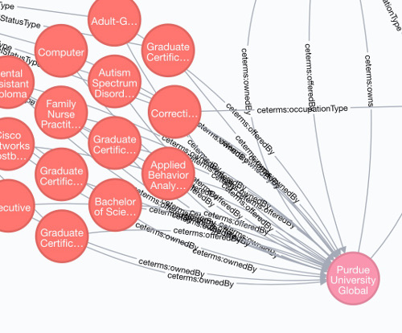

## Searching with Gremlin

In addition to the regular search API, the Credential Registry provides a
property graph database that is accessible using Apache Tinkerpop's
[Gremlin](http://tinkerpop.apache.org/) language and tools.

### Data model

The following rules are followed when transforming JSON-LD documents into
objects in the property graph:

- Each JSON-LD document is a vertex.
- Property values, when they are literals, become properties in the vertex.
- Arrays of literal values become lists of values in the vertex.
- Property values that are documents become vertices.
  - The edge between the parent document and the inner document is identified
    by the property key.
- Property values that reference other documents with `@id`, or identified as
  references in the `@context` metadata of the document, become vertices.
  - The edge between the parent document and the inner document is identified
    by the property key.



### Connecting to the Credential Registry Gremlin server

```
Sandbox URL: sandbox.credentialengineregistry.org
Sandbox Port: 8182
Sandbox username: credentialregistry
Sandbox password: 8Zc7NJIMFDSrUIv
```

The server uses SSL and SASL authentication (username/password).

For prototyping queries, we suggest using
[Gremlin Console](https://tinkerpop.apache.org/docs/current/tutorials/the-gremlin-console/).
See [remote-secure.yaml](../db/gremlin-config/console/remote-secure.yaml) for an example console configuration.

After downloading Gremlin Console and the example configuration, start a new
session by running `bin/gremlin.sh` from the console root.

```
$ db/gremlin/console/bin/gremlin.sh
gremlin> :remote connect tinkerpop.server /path/to/config.yaml session
gremlin> :remote console
gremlin> g.V().hasLabel('ceterms:BachelorDegree').limit(5).valueMap('ceterms:name')
==>{ceterms_name=[Bachelor of Science in Information Technology]}
==>{ceterms_name=[Bachelor of Science in Computer Science]}
==>{ceterms_name=[Bachelor of Science in Information Technology]}
==>{ceterms_name=[Bachelor of Science in Surveying Engineering]}
==>{ceterms_name=[Bachelor of Professional Studies - Organizational Leadership]}
gremlin>
```

### Connecting via HTTP

The HTTP API has an endpoint for proxying requests to Gremlin. Example usage:

```
curl -X POST -H content-type:application/json --insecure -u credentialregistry:8Zc7NJIMFDSrUIv -d "{\"gremlin\":\"g.V().count()\"}" "https://sandbox.credentialengineregistry.org/gremlin"
```

See [here](http://tinkerpop.apache.org/docs/current/reference/#_connecting_via_http) for more info.

A `__payload` property is available in each vertex with the original document
that was submitted to the API.

### Example queries

See the documentation file for [example Gremlin queries](07_search_03_gremlin_queries.md).

### Backend implementation

Our Gremlin endpoint is backed by two Neo4j databases running in high
availability mode with a read-only replica. The graph that is publicly
exposed by Gremlin is the read-only replica.

Indexing happens real time as new documents are published via the API. There is
a Java service running in the background that does the indexing. The Ruby
backend API notifies this service by a Redis message as new envelopes are
submitted or old ones deleted.

### Rake tasks

Some Rake tasks are available for controlling the indexing process:

- `schemas:load_contexts`: load JSON contexts used for identifying reference
  property keys in `@graph` documents.
- `gremlin:create_indices`: creates Neo4j indexes for faster lookups.
- `gremlin:index_all`: reindexes the database.
