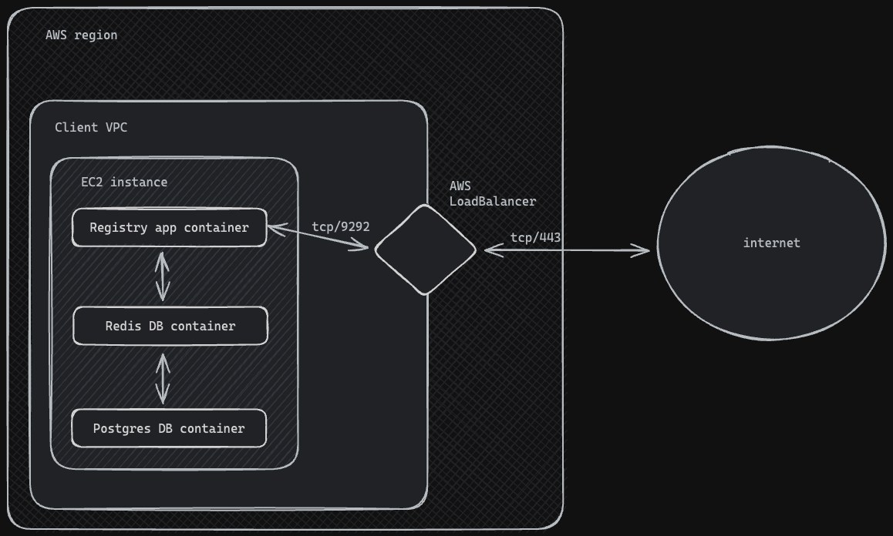

# INTRO

This document contains instructions to set up the Registry application as docker containers, it is based on the assumption that the workstation is Debian/Ubuntu.

NOTE: this procedure is meant to be executed by an individual with basic docker/container management skills. We will be installing docker, docker-compose, building docker images, running docker containers, etc.

## Overall Solution



## Pre-requisites

1. Install Docker (below instructions might vary depending on the workstation's operating system)
   Hint:

```
    sudo apt install docker -y
    sudo usermod ec2-user -G docker
```

2. Install Docker Compose (below instructions might vary depending on the workstation's operating system)
   Hint:

```
    sudo systemctl start docker
    sudo apt install git -y
    sudo curl -L https://github.com/docker/compose/releases/latest/download/docker-compose-$(uname -s | tr '[:upper:]' '[:lower:]')-$(uname -m) -o /usr/bin/docker-compose && sudo chmod 755 /usr/bin/docker-compose && docker-compose --version
```

## Docker Image Build

If not already built the Registry application image must be build:

1. In your workstation access the CredentialRegistry repository (master branch)
2. Create a docker image of the registry application
   Hint:
   ```
    docker build --no-cache  . -t credentialregistry-app:latest --build-arg RUBY_VERSION=$(cat .ruby-version) --build-arg SECRET_KEY_BASE=[secret key string]
    
   ```
**IMPORTANT NOTE:** The environment variable `SECRET_KEY_BASE` is used to sign cookies, if this variable is not provided as a build argument in the above command it defaults to randomly generated one and will be different among containers created upon the same image, that might imply a problem if using multiple pods/containers. Its value might be any string, although it is recommended to be at least 32 hex chars, ie: using linux command `openssl rand -hex 32`.

## Registry Setup

If you're going to use SSO, configure the server, then set the SSO environment variables as described [here](/docs/09_single-sign-on.md).

Create and start the containers, then prepare the database:

```bash
# Make sure that Ruby version in Dockerfile (line #1) matches the `.ruby-version` file (ie: `3.4.3`)
docker-compose up -d
docker-compose run app bundle exec rake db:create db:migrate
```

### Obtain an Access Token

If you're using SSO, obtain a token as described [here](/docs/09_single-sign-on.md#access-token).

Otherwise, generate a token by running this command and write down the resulting 32 alphanumeric code:

```bash
docker-compose run app bin/rake app:generate_auth_token ADMIN_NAME=[Admin name] PUBLISHER_NAME=[Publisher name] USER_EMAIL=[valid email address]
```

### Create a Community

If you're using SSO, perform the following request using the token obtained in the previous step:

```bash
curl --request POST \
  --url http://localhost:9292/metadata/envelope_communities \
  --header 'Authorization: Bearer [your token]…' \
  --data '{
    "name": "[community_name]",
    "default": true,
    "secured_search": false,
    "secured_search": true
  }'
```

Make sure that the `[community name]` parameter's value is the name of the community mapped to your SSO client scope. Other values will result in a 405 error.

Otherwise, create it in the console:

```bash
docker-compose run app bundle exec rake app:create_envelope_community -- --name [community name] --default yes --secured no --secured-search yes
```

### Upload a Config

```bash
curl -X POST localhost:9292/metadata/[community name]/config \
  --header 'Authorization: Bearer [the previously obtained token]' \
  --header 'Content-Type: application/json' \
  --data '{
    "description": "Minimal config",
    "payload": {
      "id_field": "ceterms:ctid",
      "skip_validation_enabled": true
    }
  }'
```

The full config format is described [here](/docs/10_community-config.md).
